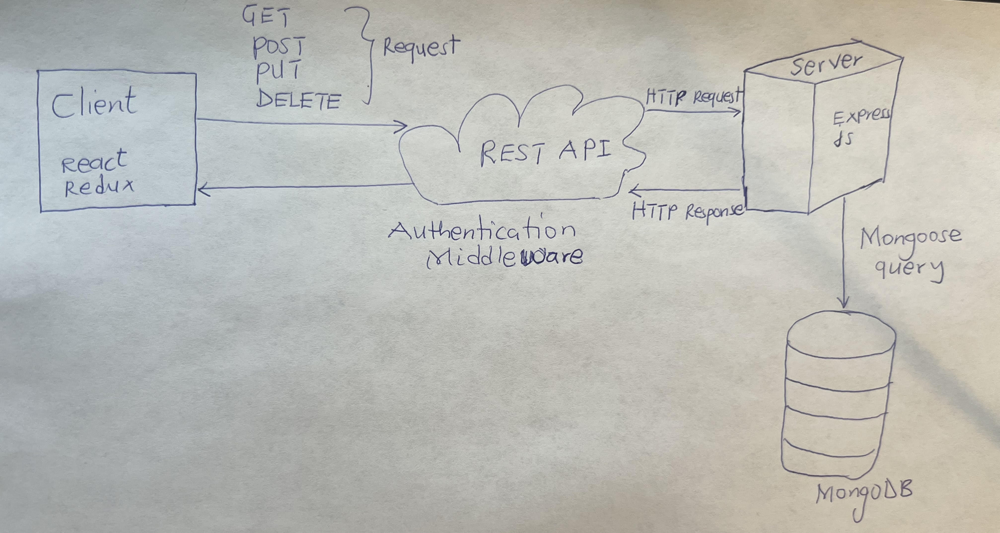

# WineHubSite

WineHubSite is a robust, full-featured e-commerce platform developed for WinHub
LLC, designed to elevate the online presence and sales capacity of their wine
retail business. This application serves as an all-encompassing solution for
product discovery, user engagement, and secure transaction processing.The store
did not have any online platform for sales of products and this affected sales
and customer reach. So in order to help in that regard, I was conracted to build
a fullstack ecommerce site to solve thisproblem

## Features

- **Product Search**: Intuitive searching capabilities that allow users to find
  products quickly.
- **User Authentication**: Secure login/logout functionality, including
  persistent user sessions.
- **User Reviews**: Logged-in users can write and submit product reviews.
- **Admin Panel**: Comprehensive administrative features for product and user
  management.
- **Secure Checkout**: Integration with PayPal for secure payment processing.

## Frontend

Developed frontend technology to ensure a responsive and interactive user
experience:

- **React**: Leveraging the power of React for a dynamic and single-page
  application feel.
- **Vite**: Utilizing Vite as the build tool for rapid development cycles and
  optimized production builds.
- **Redux Toolkit (RTK) Query**: Employing RTK Query for efficient data fetching
  and global state management.
- **Styling**: Styled using Bootstrap, React-Bootstrap, and custom CSS for a
  modern and mobile-responsive layout.

## Backend

The backend infrastructure is built for performance, scalability, and ease of
maintenance:

- **Node.js and Express.js**: The application logic is handled by Express.js,
  providing a lightweight and flexible server framework.
- **MVC Architecture**: Organized according to the Model-View-Controller (MVC)
  paradigm for clear separation of concerns.
- **RESTful API**: Designed with REST principles for a scalable and intuitive
  API endpoint structure.
- **Authentication**: Secured with JSON Web Tokens (JWT) and HTTP Only Cookies
  for robust security measures.

## Database

Chosen for its flexibility and scalability, the database layer is crafted to
handle diverse data needs:

- **MongoDB**: A NoSQL database for handling dynamic, schema-less data with
  efficiency.
- **Mongoose ODM**: Facilitates object data modeling and CRUD operations,
  simplifying database interactions.

## Hosting and Deployment

Hosted on a platform that guarantees reliability and seamless deployment:

- **Render**: Chosen for its ease of use, Render provides hosting along with
  CI/CD pipelines, ensuring that the latest version of the application is always
  live.
- **Continuous Integration/Continuous Deployment**: Integrated with GitHub, the
  CI/CD pipeline automates the deployment process, reflecting new changes with
  each push.

## Project Architecture

Below is the high-level architecture of the WineHubSite project, showcasing the
interaction between the frontend, backend, and database components.



## Local Development

To run the project locally, follow these steps:

```bash
# Clone the repository
git clone https://github.com/asahad/winehubsite.git

# Navigate to the server directory
cd winehubsite

# Install backend dependencies and start the server
npm install
npm start

# Navigate to the frontend directory in a new terminal window
cd frontend

# Install frontend dependencies and start the client
npm install
npm run dev

```
